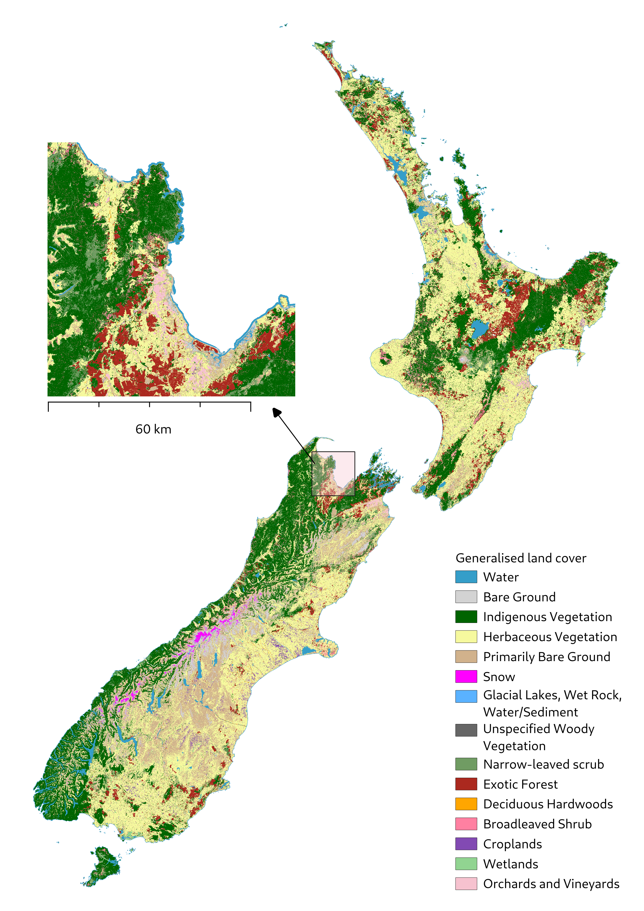
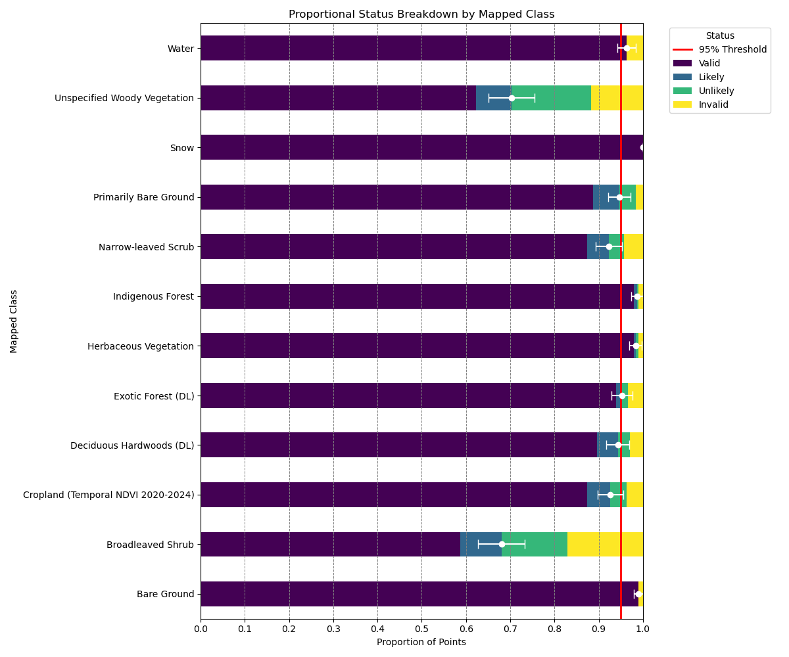

# New Zealand land cover mapping methodology using Sentinel-2 imagery

[![CC BY-SA 4.0][cc-by-sa-shield]][cc-by-sa]

National land cover mapping is a core component of New Zealand‘s environment monitoring system.  Since 1996, national land cover maps have been produced approximately every five years and are collectively known as the Land Cover Database (LCDB).   

LCDB data is used in a wider range of applications including: 

- environmental reporting indicators 
- wildfire threat analysis 
- land use modelling 
- erosion risk modelling 
- threatened environments analysis 
- land use mapping for international greenhouse gas reporting (LUCAS programme)

Each update to the LCDB is time consuming and costly to produce. 

Many stakeholders have expressed the need for another more timely land cover mapping product.  This could either be delivered through existing global land cover data sets or through the development of new bespoke methods to automatically map New Zealand’s land cover from freely available satellite imagery. 

This repository contains code and trained models representing an automated method to map New Zealand's land cover into ~15 land cover classes, and the results of validation exercises. 

## Methodology

We implemented an automated method to generate a basic land cover map over New Zealand, comprising sixteen important land cover classes from publicly accessible Sentinel-2 satellite imagery by the following sequence of actions:

- Accurate cloud-clearing and radiance standardisation of imagery enabling preprocessing of satellite imagery to seamless mosaics, permitting/enabling? the application of spectral rules and deep learning to map land cover to high accuracy.
- Spectral rules to delineate a hierarchy of land cover classes, to separate land from water, and then bare ground from vegetation. Vegetation is then split into herbaceous and woody vegetation.
- Deep learning to subtract exotic forest and deciduous hardwoods from the woody class, permitting the remaining to be divided into narrow-leaved scrub, broadleaved shrubs, and indigenous forest
- Labelling of small patches of unclassified woody vegetation as unspecified woody.
- Identifying croplands by the proportion of time they are bare over five years of Sentinel-2 imagery.
- Since they are difficult to identify from spectral information burning in wetlands and vineyards from the Land Cover Database.
- Assessing overall accuracy by one expert validator examining a stratified random sample of points

## Results

Land cover map for the 2023-24 summer.

## Validation

The overall accuracy of this classification is **96.03%**. All but two of the classes (unspecified woody vegetation, and broadleaved shrub) are >90% accurate. These two poorly performing classes are relatively minor in terms of total areal coverage.

In the figure below, the white error bar is the 95% margin of error; "likely" results are assumed valid, and "unlikely" results are assumed invalid, rather than excluding indeterminate results.

## Reports

<!-- TODO -->

Two associated reports are in preparation and will be included here when they are finalised:

- [Evaluation of Global Land Cover Datasets](./docs/Evaluation%20of%20Global%20Land%20Cover%20Datasets.pdf)
- Cost-effective land cover mapping

## Acknowledgements

We wish to acknowledge the use of New Zealand eScience Infrastructure (NeSI) high performance computing facilities, consulting support and/or training services as part of this research. New Zealand's national facilities are provided by NeSI and funded jointly by NeSI's collaborator institutions and through the Ministry of Business, Innovation & Employment's Research Infrastructure programme. https://www.nesi.org.nz. 

## License

This work is licensed under a
[Creative Commons Attribution-ShareAlike 4.0 International License][cc-by-sa].

[![CC BY-SA 4.0][cc-by-sa-image]][cc-by-sa]

[cc-by-sa]: http://creativecommons.org/licenses/by-sa/4.0/
[cc-by-sa-image]: https://licensebuttons.net/l/by-sa/4.0/88x31.png
[cc-by-sa-shield]: https://img.shields.io/badge/License-CC%20BY--SA%204.0-lightgrey.svg